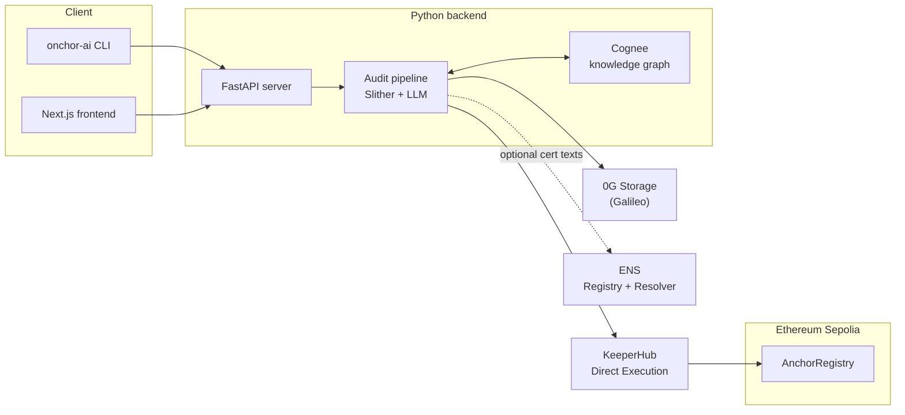

### Hackathon — ETHGlobal Open Agents 2026

---

# ONCHOR.AI

**Onchor.ai** is a Solidity security copilot with **persistent collective memory**: it runs static analysis and LLM-assisted reasoning on your contracts, learns vulnerability patterns across audits, stores payloads on **0G**, and can anchor high-confidence findings on-chain via **KeeperHub**, with **ENS** text records for auditable certifications.

---

### 1. 0G (decentralized storage)

- **Pattern payloads on Galileo:** CONFIRMED / LIKELY findings are serialized (title, reason, severity, file, line, etc.) and uploaded through the `0g/` Node helpers; the pipeline records a **`rootHash`** used as the immutable content pointer.
- **Modes:** `OG_STORAGE_MODE` supports `live` (real 0G testnet), `merkle` (root only), and `mock` (local files under `backend/storage/.zero_g_mock/`). See `backend/storage/zero_g_client.py`.
- **Wallet / gas:** Galileo testnet for storage operations


---

### 2. KeeperHub

- **MPC-backed execution:** High-confidence findings call KeeperHub's **Direct Execution** API (`POST https://app.keeperhub.com/api/execute/contract-call`) to invoke `AnchorRegistry.anchor(patternHash, rootHash0G)` on Ethereum Sepolia without putting your user key in the hot path for that transaction.
- **Proof:** Responses expose `transactionHash` / `executionId`; the backend can resolve the on-chain tx via Etherscan for display and ENS tooling. See `backend/keeper/hub_anchor.py` and `backend/pipeline/phase5_anchor.py`.

---

### 3. ENS — identity & audit ledger

- **Certified subtree:** Parent name defaults to `certified.onchor-ai.eth`; scripts mint or update subnames and resolver **text** records (verdict, counts, tx proof, report hash, audit date) so wallets and explorers can read a tamper-evident audit summary on-chain.
- **Flow:** Off-chain report hash and KeeperHub tx proof can be written to ENS text keys after an anchor succeeds, linking **0G root**, **on-chain anchor**, and **human-readable ENS** in one story.

---

### 4. Collective memory (Cognee)

Onchor is not a one-shot auditor: it **accumulates knowledge** across runs so later audits benefit from what the agent (and the community) already learned. That is the core of an **open agent**: memory that persists and compounds.

- **Knowledge graph:** After each audit, sanitized findings can be ingested into **Cognee** via `cognee.add` / `cognee.cognify`, building a structured graph of **vulnerability patterns** tied to contract context. Recall uses semantic search over that graph (`load_known_findings` / `cognee.search`).
- **Paid path:** In the default **pip-install** flow, audits are **paid via x402**; that run uses **collective memory** (curated external corpora and prior graph context) during analysis.
- **Opt-in contribution:** At the **end** of a paid audit, the CLI asks if you want to contribute **anonymized** patterns to the shared memory. If you accept, you get a small **USDC** reward on **Base Sepolia**: **0.05 USDC per finding**, for **up to three findings** each time you opt in (capped at three rewarded patterns per contribution).

---

## Demo

- **Video:** 
---

## System architecture



---

## Getting started

**Requirements:** Python 3.10+.

1. **Install the CLI**

   ```bash
   pip install onchor-ai
   ```

 A one-time wizard creates a wallet. Your private key is written to ./.env.user — back it up and never commit that file. 


2. **Fund (before the first run)**  
   Get **USDC on Base Sepolia** so you can fund the wallet the wizard will create — e.g. [Circle faucet](https://faucet.circle.com).  then press Enter so the CLI can check the balance.
3. **Run**  

   ```bash
   onchor-ai audit <target>
   ```

   **What you can pass as `<target>`**

   - **Directory** — e.g. `onchor-ai audit .` audits the current project; **all `*.sol` files under that folder are collected recursively** (subfolders included).
   - **Single Solidity file** — path to one `.sol`.
   - **On-chain address** — `onchor-ai audit 0x…` for a contract **verified on Etherscan** (including **Ethereum mainnet**): the API pulls verified source via **Etherscan** (set **`ETHERSCAN_CHAIN_ID`** on the server, e.g. `1` for mainnet, `11155111` for Sepolia).

---

*Built for ETHGlobal Open Agents 2026.*
